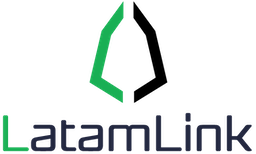

	

	
	

## Descripción 
Documentación técnica para el testnet LatamLink [docs.latamlink.io](https://docs.latamlink.io)

Este sitio web es creado usando [https://docusaurus.io/](Docusaurus), una herramienta para mantener documentación técnica de proyectos de código libre. 

La documentación se genera a partir de archivos en formato markdown ubicados dentro de la sub-carpeta `/docs`. Ver mas información [aquí](https://github.com/LatamLink/documentacion/tree/master/website).

[docs.latamlink.io](https://docs.latamlink.io) esta alojado en GitHub y se publica mediante el siguiente comando:

`GIT_USER=LatamLink CURRENT_BRANCH=master USE_SSH=true npm run publish-gh-pages`

## Como Contribuir

Utilizamos un tablero de estilo Kanban para priorizar el trabajo. [Ir al tablero del proyecto](https://github.com/EOS-Jungle-Testnet/LatamLink/documentacion/projects/1).

Los principales canales de comunicación son [github issues](https://github.com/LatamLink/documentacion/issues) y el [canal de Telegram](https://t.me/latamlink). Siéntase libre mandar todas las preguntas que pueda tener.

Pautas para contribuyentes. [https://developers.eoscostarica.io/docs/open-source-guidelines](https://developers.eoscostarica.io/docs/open-source-guidelines).

Informe cualquier idea o errores grandes y pequeños [abriendo un "issue"](https://github.com/LatamLink/documentacion/issues).

## Licencia

MIT © [LatamLink Testnet](https://latamlink.io)  